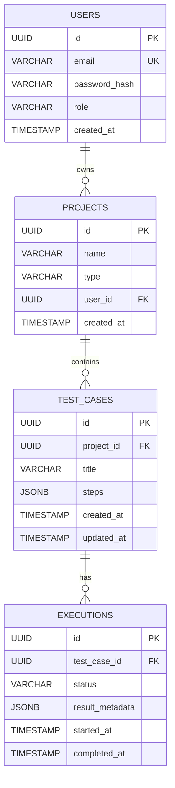

# Database Schema (PostgreSQL)



## SQL Definition (Draft)

```sql
CREATE TABLE users (
    id UUID PRIMARY KEY DEFAULT gen_random_uuid(),
    email VARCHAR(255) UNIQUE NOT NULL,
    hashed_password VARCHAR(255) NOT NULL,
    is_active BOOLEAN DEFAULT TRUE,
    role VARCHAR(50) DEFAULT 'TESTER'
);

CREATE TABLE projects (
    id UUID PRIMARY KEY DEFAULT gen_random_uuid(),
    title VARCHAR(255) NOT NULL,
    project_type VARCHAR(50),
    owner_id UUID REFERENCES users(id)
);

CREATE TABLE test_cases (
    id UUID PRIMARY KEY DEFAULT gen_random_uuid(),
    project_id UUID REFERENCES projects(id),
    title VARCHAR(255) NOT NULL,
    steps JSONB DEFAULT '[]', -- List of steps
    created_at TIMESTAMP DEFAULT now()
);

CREATE TABLE test_runs (
    id UUID PRIMARY KEY DEFAULT gen_random_uuid(),
    test_case_id UUID REFERENCES test_cases(id),
    status VARCHAR(50) DEFAULT 'PENDING', -- PENDING, RUNNING, PASSED, FAILED
    logs TEXT,
    video_url VARCHAR(500),
    created_at TIMESTAMP DEFAULT now()
);
```
